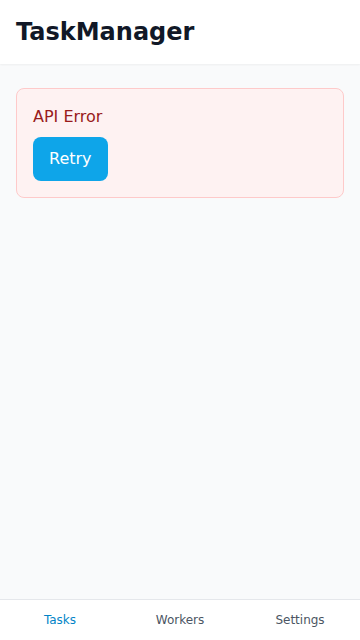
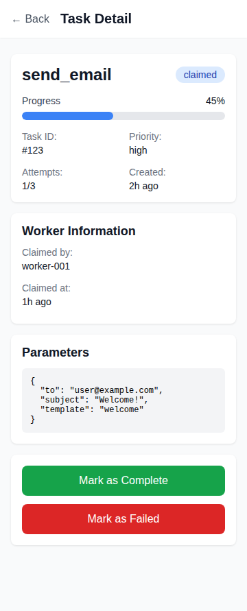

# TaskManager User Guide

**Version**: 0.1.0  
**Last Updated**: 2025-11-09  
**Target Audience**: End Users, Task Workers

---

## Table of Contents

1. [Introduction](#introduction)
2. [Getting Started](#getting-started)
3. [Task Management](#task-management)
4. [Worker Dashboard](#worker-dashboard)
5. [Settings](#settings)
6. [FAQ](#faq)

---

## Introduction

### What is Frontend/TaskManager?

Frontend/TaskManager is a mobile-first web application designed for efficient task management. It provides workers with an intuitive interface to view, claim, and complete tasks assigned through the Backend/TaskManager system.

### Key Features

- **Mobile-First Design**: Optimized for mobile devices (Redmi 24115RA8EG)
- **Task Claiming**: Quick one-tap task claiming
- **Real-Time Updates**: Automatic task status synchronization
- **Worker Dashboard**: Monitor task progress and worker activity
- **Touch-Optimized**: All UI elements designed for easy touch interaction

### Who is this for?

This application is designed for:
- Task workers who need to claim and complete tasks
- Team leads monitoring task progress
- Administrators managing the task workflow

---

## Getting Started

### Accessing the Application

1. Open your web browser (Chrome, Firefox, Safari)
2. Navigate to the TaskManager URL provided by your administrator
3. The application will load with the Task List view

### First-Time Setup

#### Configure Your Worker ID

Before claiming tasks, you need to configure your Worker ID:

1. Tap the **Settings** icon (⚙️) in the bottom navigation
2. Find the **Worker ID** section
3. Enter your assigned Worker ID (e.g., "worker01", "worker02")
4. Tap **Save Settings**
5. Your Worker ID is now saved and will be remembered

#### Configure API Settings

If not already configured, set up the API connection:

1. Go to **Settings** (⚙️)
2. In the **API Configuration** section:
   - **API Base URL**: Enter the Backend TaskManager URL (default: `http://localhost:8080`)
   - **API Key**: Enter your API authentication key
3. Tap **Save Settings**
4. The app will validate the connection

---

## Task Management

### Viewing Tasks

#### Task List View

The main view shows all available tasks:

- **Task Card**: Each task is displayed as a card with:
  - Task Type (e.g., "example", "data_processing")
  - Status Badge (Pending, In Progress, Completed, Failed)
  - Priority indicator
  - Task ID
  - Creation timestamp

#### Task Status Colors

- 🔵 **Pending** (Blue): Task waiting to be claimed
- 🟡 **In Progress** (Yellow): Task currently being worked on
- 🟢 **Completed** (Green): Task successfully finished
- 🔴 **Failed** (Red): Task encountered an error

#### Filtering Tasks

Use the filter tabs at the top to view specific task statuses:
- **All**: Show all tasks
- **Pending**: Only unclaimed tasks
- **In Progress**: Tasks currently being worked on
- **Completed**: Successfully finished tasks
- **Failed**: Tasks that need attention

### Claiming a Task

To claim a task and start working on it:

1. **Navigate to Task Details**:
   - Tap on any task card in the Task List
   - The Task Detail view will open

2. **Review Task Information**:
   - Check the task type and parameters
   - Verify the task is in "Pending" status
   - Review any special requirements

3. **Claim the Task**:
   - Tap the **Claim Task** button
   - The button will show a loading state
   - Once claimed, the task status changes to "In Progress"
   - The button changes to **Complete Task**

**Important Notes**:
- You must configure your Worker ID in Settings before claiming tasks
- Only tasks in "Pending" status can be claimed
- Once claimed, the task is assigned to you

### Completing a Task

After finishing work on a task:

1. **Open the Task Details** (if not already open)
2. **Tap "Complete Task"** button
3. **Confirmation Modal** will appear:
   - Review the task completion confirmation
   - Tap **Confirm** to mark as complete
   - Or tap **Cancel** to go back
4. **Task Status Updates**:
   - Status changes to "Completed"
   - Success message appears
   - Task is removed from your active tasks

### Task Detail Information

The Task Detail view shows:

- **Task Type**: The category of task
- **Status**: Current task state with color-coded badge
- **Progress Bar**: Visual indicator of task completion (for claimed tasks)
- **Task ID**: Unique identifier
- **Priority**: Task priority level
- **Created At**: When the task was created
- **Attempts**: Current attempt count vs maximum allowed
- **Worker Information**: Details about who claimed the task and when
- **Parameters**: Task-specific data and configuration
- **Result**: Task output (if completed)
- **Error Message**: Error details (if failed)
- **Action Buttons**: Mark as Complete or Mark as Failed

---

## Worker Dashboard

### Accessing the Dashboard

Tap the **Workers** icon in the bottom navigation.

### Dashboard Features

The Worker Dashboard provides:

- **Worker Information**: Your unique worker ID and current status
- **Worker Status**: Toggle between Active and Idle states
- **Task Actions**: Claim next available task from the queue
- **Integration Example**: Sample code showing how to use worker functionality

### Monitoring Task Progress

- View real-time task counts by status
- Monitor overall system health
- Check for failed tasks that need attention

---

## Settings

### Accessing Settings

Tap the **Settings** icon (⚙️) in the bottom navigation.

### API Configuration

Configure how the app connects to the TaskManager backend:

- **API Base URL**: The URL of the Backend/TaskManager service
  - Example: `http://localhost:8080`
  - Example: `https://taskmanager.yourdomain.com`
- **API Key**: Your authentication key for API access

**To Update**:
1. Enter the new value in the input field
2. Tap **Save Settings**
3. The connection will be validated

### Worker Configuration

Set your worker identity:

- **Worker ID**: Your unique worker identifier
  - Format: lowercase, alphanumeric (e.g., "worker01")
  - Used when claiming and completing tasks
  - Required before claiming any tasks

**To Update**:
1. Enter your Worker ID
2. Tap **Save Settings**
3. Your ID is saved locally on your device

### Testing Connection

After configuring settings:
1. Return to the Task List
2. Pull down to refresh
3. If tasks load successfully, your connection is working
4. If you see an error, check your API settings

---

## FAQ

### General Questions

**Q: Do I need an account to use TaskManager?**  
A: Currently, you only need a Worker ID to claim tasks. No separate login is required.

**Q: Can I use TaskManager on my phone?**  
A: Yes! TaskManager is optimized for mobile devices, especially the Redmi 24115RA8EG.

**Q: Is an internet connection required?**  
A: Yes, TaskManager requires an active connection to the Backend/TaskManager API.

### Task Management

**Q: Why can't I claim a task?**  
A: Make sure:
- Your Worker ID is configured in Settings
- The task status is "Pending"
- You have a valid API connection
- The task hasn't already been claimed by another worker

**Q: What happens if I accidentally claim the wrong task?**  
A: Currently, you cannot unclaim a task. Contact your administrator if you need to release a task.

**Q: Can I claim multiple tasks at once?**  
A: Yes, you can claim multiple tasks, but you can only view one Task Detail at a time.

**Q: How do I know if a task failed?**  
A: Failed tasks are marked with a red "Failed" badge. Check the Task Detail for error messages.

### Technical Issues

**Q: The app is not loading tasks. What should I do?**  
A: 
1. Check your internet connection
2. Verify API settings (Settings → API Configuration)
3. Try refreshing the Task List (pull down)
4. Check if the Backend/TaskManager service is running

**Q: I see "Failed to fetch tasks" error**  
A:
- Verify the API Base URL is correct
- Check if the Backend service is accessible
- Confirm your API key is valid
- Check browser console for detailed errors

**Q: The app is slow or unresponsive**  
A:
- Try refreshing the page
- Clear browser cache
- Check your internet connection speed
- Contact support if the issue persists

**Q: Can I use TaskManager offline?**  
A: No, TaskManager requires a connection to the Backend API at all times.

### Settings & Configuration

**Q: Where is my Worker ID stored?**  
A: Your Worker ID is stored in your browser's local storage. It will persist even if you close the browser, but it's specific to your device.

**Q: What if I forget my Worker ID?**  
A: Contact your administrator to retrieve your Worker ID.

**Q: Can I change my Worker ID later?**  
A: Yes, you can update your Worker ID in Settings at any time.

---

## Troubleshooting

### Common Issues and Solutions

#### Issue: Cannot See Any Tasks

**Possible Causes**:
- API connection issue
- No tasks available in the system
- API Base URL incorrect

**Solutions**:
1. Go to Settings and verify API Base URL
2. Pull down on Task List to refresh
3. Check browser console for errors
4. Contact administrator

#### Issue: Claim Task Button Not Working

**Possible Causes**:
- Worker ID not configured
- Task already claimed
- API connection issue

**Solutions**:
1. Configure Worker ID in Settings
2. Refresh the task to check current status
3. Check browser console for errors

#### Issue: Task Status Not Updating

**Possible Causes**:
- Cache issue
- API delay
- Network problem

**Solutions**:
1. Pull down to refresh the Task List
2. Navigate away and back to the Task Detail
3. Check your internet connection

---

## Best Practices

### For Workers

1. **Configure Settings First**: Set your Worker ID before claiming tasks
2. **Review Before Claiming**: Read task details before claiming
3. **Complete Promptly**: Don't leave claimed tasks incomplete for too long
4. **Check Failed Tasks**: Monitor and address failed tasks
5. **Refresh Regularly**: Pull down to refresh task list periodically

### For Performance

1. **Close Unused Tabs**: Keep only one TaskManager tab open
2. **Clear Old Data**: Refresh the page if it feels slow
3. **Use Modern Browser**: Chrome, Firefox, or Safari recommended
4. **Stable Connection**: Use WiFi for best performance

### For Administrators

1. **Provide Clear Worker IDs**: Use consistent naming (worker01, worker02, etc.)
2. **Monitor Failed Tasks**: Check dashboard for failed task patterns
3. **Set API Key Properly**: Ensure workers have valid API access
4. **Test Connection**: Verify backend is accessible before deploying

---

## Getting Help

If you encounter issues not covered in this guide:

1. **Check Browser Console**: Press F12 and check for error messages
2. **Contact Administrator**: Report the issue with details
3. **Include Information**:
   - What you were trying to do
   - Error messages you saw
   - Your Worker ID (if relevant)
   - Browser and device information

---

## Keyboard Shortcuts

Currently, TaskManager is optimized for touch interaction. Keyboard shortcuts may be added in future versions.

---

## Accessibility

TaskManager is designed with accessibility in mind:

- **Touch Targets**: All buttons are minimum 44px × 44px
- **Color Contrast**: WCAG 2.1 AA compliant (4.5:1 ratio)
- **Screen Readers**: Basic support (being improved)
- **Keyboard Navigation**: Future enhancement

---

## Privacy & Data

- **Local Storage**: Worker ID and API settings are stored locally on your device
- **No Personal Data**: TaskManager doesn't collect personal information
- **API Communication**: All task data is transmitted via configured API
- **Browser Data**: Standard browser caching applies

---

## Version History

### Version 0.1.0 (2025-11-09)
- Initial release
- Task List view
- Task Detail view with claim/complete
- Worker Dashboard
- Settings configuration
- Mobile-first responsive design

---

**Need more help?** Contact your TaskManager administrator or system support team.
