# PrismQ Web Client - Architecture Documentation

## Overview

The PrismQ Web Client is a localhost-based web application that provides a unified interface for discovering, configuring, and running PrismQ data collection modules. It follows a modern three-tier architecture with clear separation of concerns between the presentation layer (Vue 3 Frontend), business logic layer (FastAPI Backend), and execution layer (PrismQ Modules).

## System Architecture

### High-Level Architecture

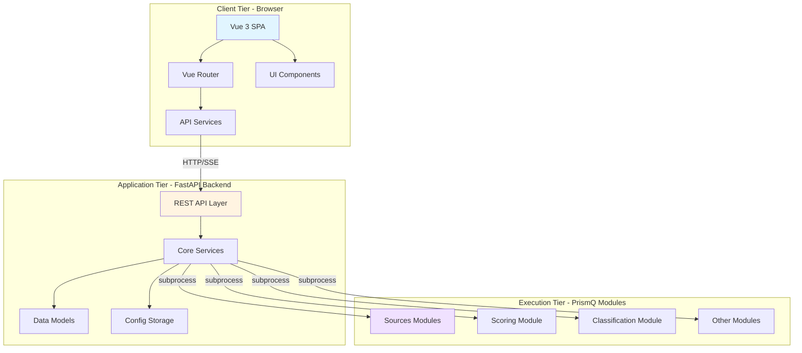

### Component Architecture

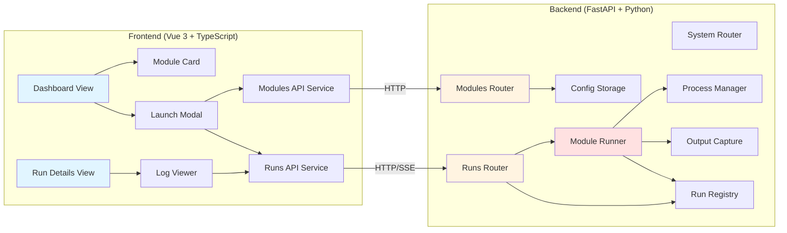

## Architecture Layers

### 1. Presentation Layer (Frontend)

**Technology Stack:**
- Vue 3 with Composition API
- TypeScript for type safety
- Vite for fast development and building
- Tailwind CSS for styling
- Axios for HTTP communication
- Vue Router for navigation
- Pinia for state management

**Key Components:**

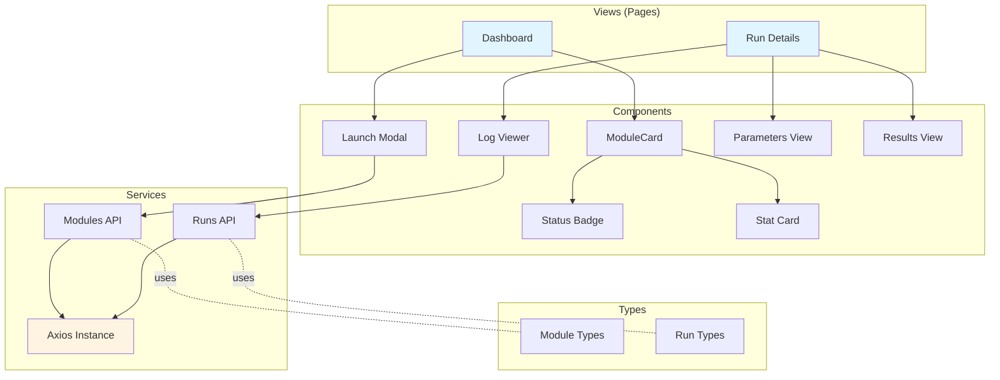

**Responsibilities:**
- Display module catalog and status
- Provide user interface for module configuration
- Launch modules with user-specified parameters
- Display real-time logs via Server-Sent Events (SSE)
- Show run history and statistics
- Persist user configurations in localStorage

### 2. Business Logic Layer (Backend)

**Technology Stack:**
- FastAPI for REST API
- Pydantic for data validation
- Uvicorn as ASGI server
- Python 3.10+ with async/await
- JSON for configuration storage

**Core Services:**

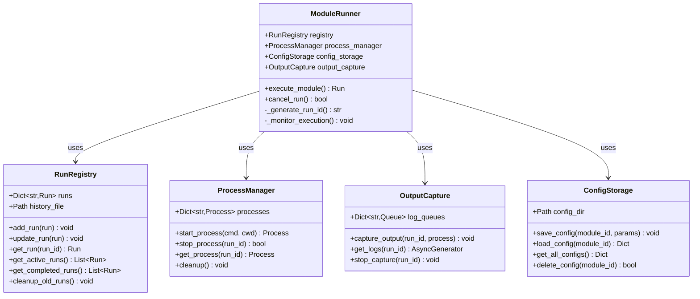

**API Routers:**

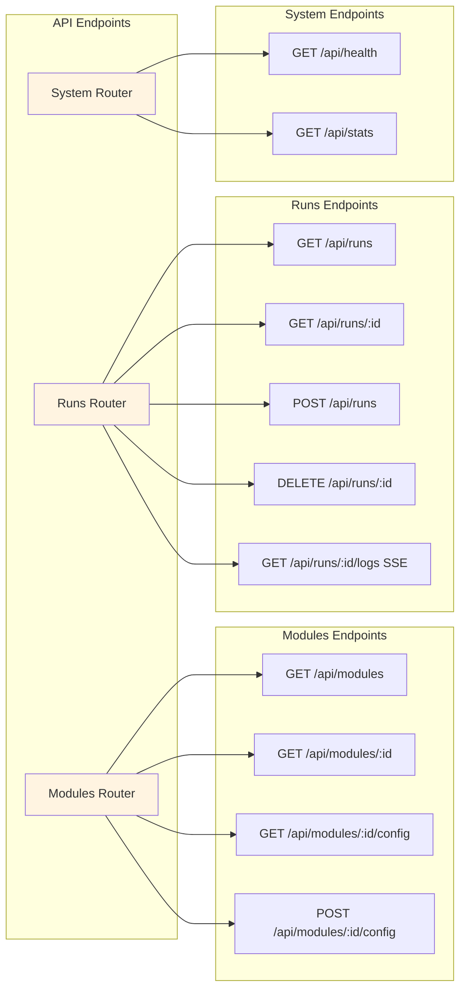

**Responsibilities:**
- Serve REST API endpoints
- Manage module configurations
- Execute modules as subprocesses
- Track run lifecycle and status
- Capture and stream module output
- Persist configurations and run history
- Handle concurrent module executions
- Provide health monitoring

### 3. Execution Layer (PrismQ Modules)

**Module Categories:**
- **Sources**: Data collection from various platforms
  - Content (YouTube, TikTok, Instagram, Reddit, etc.)
  - Signals (Trends, hashtags, topics)
  - Commerce, Events, Community, Creative, Internal
- **Scoring**: Content evaluation and ranking
- **Classification**: Content categorization
- **Model**: Core data structures

**Execution Model:**

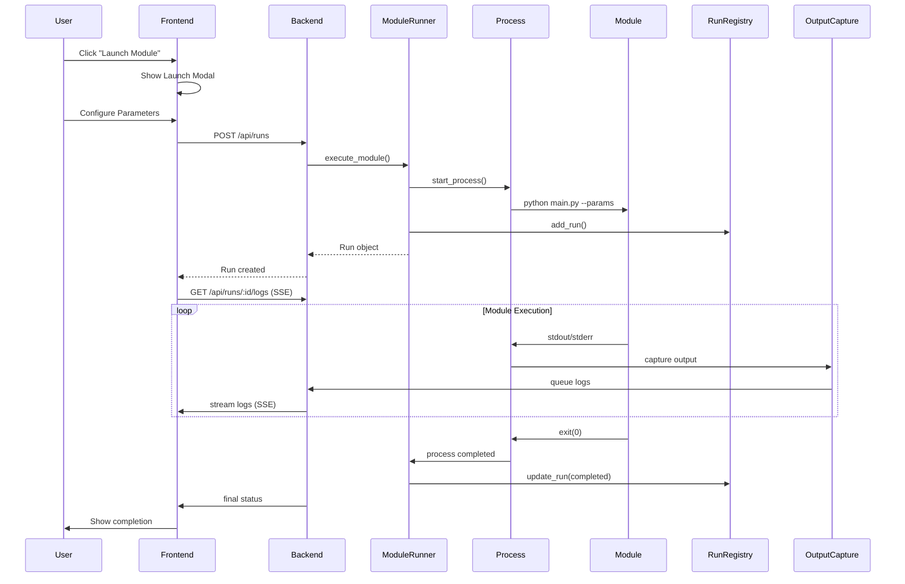

## Data Flow

### Module Execution Flow

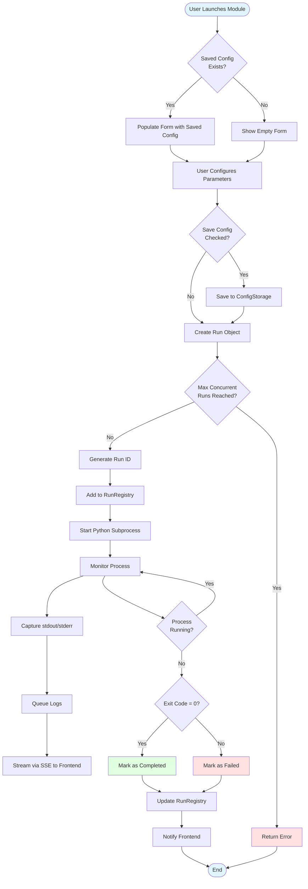

### Real-Time Log Streaming

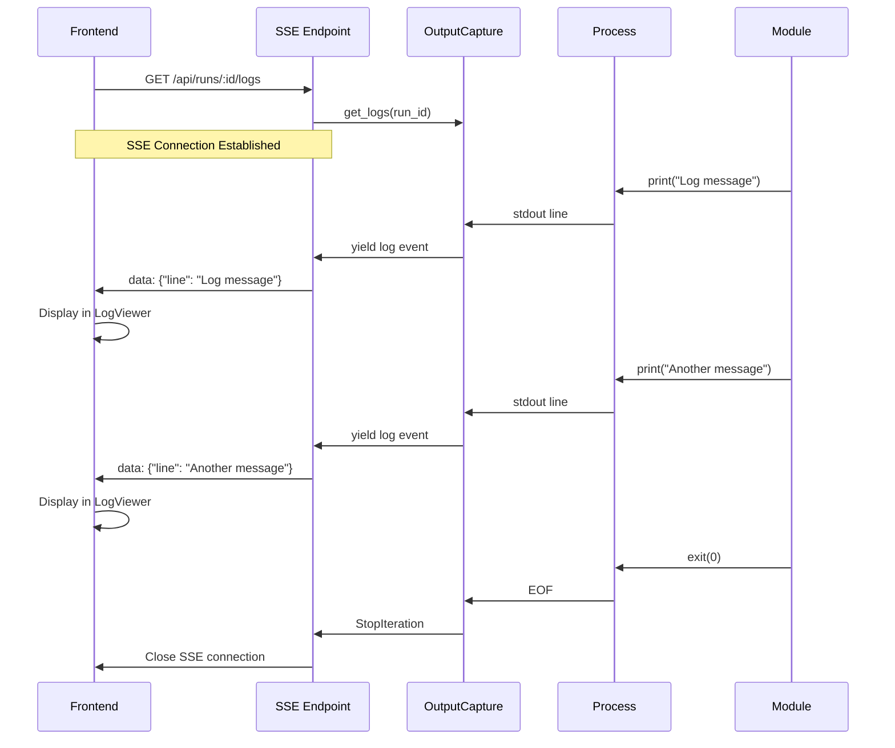

## SOLID Principles Application

The architecture follows SOLID design principles throughout:

### Single Responsibility Principle (SRP)
- **ModuleRunner**: Only orchestrates module execution
- **RunRegistry**: Only manages run storage and retrieval
- **ProcessManager**: Only handles subprocess lifecycle
- **OutputCapture**: Only captures and streams output
- **ConfigStorage**: Only persists configurations

### Open/Closed Principle (OCP)
- Services can be extended with new functionality without modifying existing code
- New module types can be added without changing the runner
- New API endpoints can be added without modifying existing routes

### Liskov Substitution Principle (LSP)
- RunRegistry could be swapped with a database-backed implementation
- ProcessManager could be replaced with a container-based implementation
- OutputCapture could use different storage backends

### Interface Segregation Principle (ISP)
- Each service provides focused, minimal interfaces
- Frontend services are separated by domain (modules, runs)
- Backend routers handle specific resource types

### Dependency Inversion Principle (DIP)
- Core services depend on abstractions (Pydantic models)
- ModuleRunner receives dependencies via constructor injection
- Configuration is injected rather than hardcoded

## Technology Decisions

### Why FastAPI?
- Native async/await support for concurrent operations
- Automatic OpenAPI/Swagger documentation
- Type safety with Pydantic
- High performance ASGI framework
- Built-in SSE support

### Why Vue 3?
- Composition API for better code organization
- Excellent TypeScript support
- Reactive data binding
- Small bundle size
- Active ecosystem

### Why Server-Sent Events (SSE)?
- Simpler than WebSockets for one-way streaming
- Automatic reconnection
- Native browser support
- Works with standard HTTP infrastructure
- Perfect for log streaming use case

### Why Subprocess Execution?
- Module isolation and sandboxing
- Independent failure domains
- Language agnostic (modules can be in any language)
- Standard stdout/stderr capture
- Easy process management

### Windows Subprocess Handling (CRITICAL) 🪟

**Platform**: Windows 10/11 (Primary deployment target)

#### The Windows Event Loop Issue

On Windows, subprocess execution requires special handling due to asyncio event loop limitations:

**Problem**: 
The default `SelectorEventLoop` on Windows **does NOT support** subprocess operations (`asyncio.create_subprocess_shell()`). Attempting to spawn subprocesses results in:

```python
NotImplementedError: Subprocess transport not supported on Windows with SelectorEventLoop
```

**Solution**: 
Use `ProactorEventLoop` which provides full subprocess support on Windows.

#### Implementation

The backend MUST be started using `uvicorn_runner.py`, which sets the correct event loop policy:

**File**: `Client/Backend/src/uvicorn_runner.py`

```python
#!/usr/bin/env python
"""
Uvicorn runner with Windows ProactorEventLoop support.
CRITICAL: Always use this script to start the backend on Windows.
"""
import sys
import asyncio

if sys.platform == "win32":
    # Set ProactorEventLoop policy for subprocess support on Windows
    asyncio.set_event_loop_policy(asyncio.WindowsProactorEventLoopPolicy())
    print("✓ Windows ProactorEventLoop policy set for subprocess support")

# Start Uvicorn
import uvicorn
from main import app

if __name__ == "__main__":
    uvicorn.run(
        "main:app",
        host="0.0.0.0",
        port=8000,
        reload=False  # Reload not compatible with ProactorEventLoop
    )
```

#### Usage (Windows)

**✓ CORRECT** - Always use on Windows:
```powershell
cd Client\Backend
py -3.10 -m src.uvicorn_runner
```

**✗ WRONG** - Will fail with NotImplementedError:
```powershell
uvicorn main:app --reload
uvicorn main:app --host 0.0.0.0 --port 8000
```

#### Windows Subprocess Creation

**File**: `Client/Backend/src/core/subprocess_wrapper.py`

```python
async def spawn_subprocess(command: str, cwd: str, env: dict):
    """
    Spawn subprocess with Windows compatibility.
    
    Note: Requires ProactorEventLoop on Windows (set in uvicorn_runner.py)
    """
    # On Windows, use shell=True for command execution
    # Path handling for Windows (backslashes)
    from pathlib import Path
    working_dir = Path(cwd).resolve()  # Windows absolute path
    
    # Create subprocess (requires ProactorEventLoop on Windows)
    process = await asyncio.create_subprocess_shell(
        command,
        stdout=asyncio.subprocess.PIPE,
        stderr=asyncio.subprocess.PIPE,
        cwd=str(working_dir),  # Windows path string
        env=env
    )
    
    return process
```

#### Output Capture (Windows Encoding)

Windows may use different text encodings (Windows-1252 vs UTF-8). Handle gracefully:

```python
async def stream_output(stream, run_id):
    """Stream subprocess output with Windows encoding handling"""
    while True:
        line = await stream.readline()
        if not line:
            break
        
        # Try UTF-8 first, fallback to Windows-1252
        try:
            text = line.decode('utf-8')
        except UnicodeDecodeError:
            text = line.decode('windows-1252', errors='ignore')
        
        # Store and stream log
        run_registry.add_log(run_id, text)
```

#### Windows Path Handling

Always use `pathlib.Path` for cross-platform compatibility:

```python
from pathlib import Path

# Module working directory (Windows backslashes handled automatically)
module_dir = Path("Sources/Content/Shorts/YouTube")
abs_path = module_dir.resolve()  # C:\Users\...\Sources\Content\Shorts\YouTube

# Database path
db_path = Path.cwd() / "youtube_shorts.db"
```

#### Verification

To verify ProactorEventLoop is active:

```python
# In Python REPL (after starting backend)
import asyncio
import sys

if sys.platform == "win32":
    policy = asyncio.get_event_loop_policy()
    print(f"Event loop policy: {policy}")
    # Should print: WindowsProactorEventLoopPolicy
    
    loop = asyncio.get_event_loop()
    print(f"Event loop type: {type(loop)}")
    # Should print: ProactorEventLoop
```

#### Related Documentation

- **[YouTube Module Execution Flow](../../Sources/Content/Shorts/YouTube/_meta/docs/EXECUTION_FLOW.md)** - Complete Windows execution flow
- **[YouTube Module Known Issues](../../Sources/Content/Shorts/YouTube/_meta/docs/KNOWN_ISSUES.md)** - Windows-specific issues
- **[YouTube Module Troubleshooting](../../Sources/Content/Shorts/YouTube/_meta/docs/TROUBLESHOOTING.md)** - Windows debugging

#### Key Takeaways

1. ✅ Always use `uvicorn_runner.py` on Windows
2. ✅ ProactorEventLoop required for subprocess support
3. ✅ Handle Windows-1252 encoding for subprocess output
4. ✅ Use `pathlib.Path` for Windows path handling
5. ⚠️ Don't use `uvicorn` directly on Windows
6. ⚠️ `--reload` may not work with ProactorEventLoop

## Security Considerations

### Current Security Features
1. **CORS Configuration**: Restricts API access to configured origins
2. **Localhost Only**: Designed for local execution only
3. **Process Isolation**: Each module runs in separate process
4. **Path Validation**: Script paths validated before execution
5. **Parameter Validation**: Pydantic models validate all inputs

### Security Limitations
- No authentication/authorization (localhost only)
- No encryption (localhost only)
- No rate limiting
- Trusts module scripts (assumes vetted code)

## Performance Characteristics

### Scalability
- **Concurrent Runs**: Configurable limit (default: 10)
- **Module Isolation**: Each module runs independently
- **Async I/O**: Backend uses async/await for non-blocking operations
- **SSE Multiplexing**: Multiple SSE connections supported

### Resource Management
- **Log Rotation**: Old runs cleaned up periodically
- **Process Cleanup**: Processes terminated on cancellation
- **Memory Management**: Logs streamed, not stored in memory
- **File System**: Configurations and history stored in JSON files

## Deployment Architecture

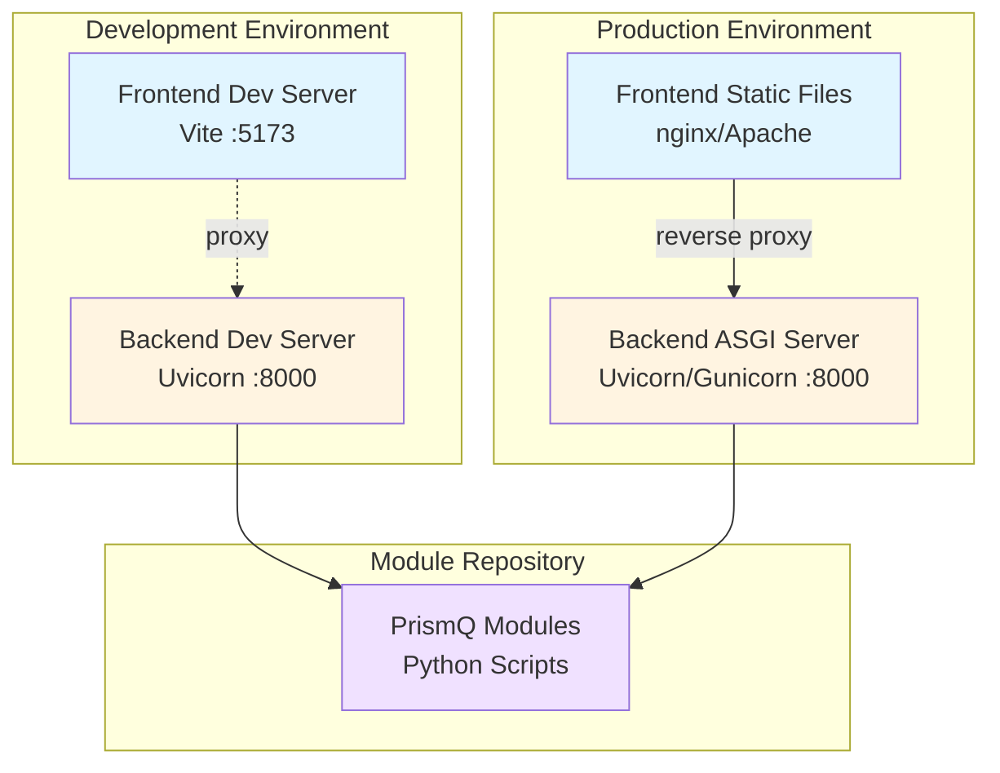

### Development Deployment
- Frontend: Vite dev server on port 5173
- Backend: Uvicorn with --reload on port 8000
- Hot module replacement for fast iteration

### Production Deployment (Future)
- Frontend: Static build served by nginx/Apache
- Backend: Uvicorn behind reverse proxy
- Process manager (systemd/supervisor) for backend
- Static file caching

## Directory Structure

```
Client/
├── Backend/                    # FastAPI Backend Application
│   ├── src/                   # Source code
│   │   ├── main.py           # FastAPI app entry point
│   │   ├── api/              # API route handlers
│   │   │   ├── modules.py    # Module endpoints
│   │   │   ├── runs.py       # Run endpoints
│   │   │   └── system.py     # System endpoints
│   │   ├── core/             # Core business logic
│   │   │   ├── config.py     # Configuration management
│   │   │   ├── logger.py     # Logging setup
│   │   │   ├── module_runner.py      # Module execution orchestration
│   │   │   ├── run_registry.py       # Run state management
│   │   │   ├── process_manager.py    # Subprocess management
│   │   │   ├── output_capture.py     # Log capture and streaming
│   │   │   └── config_storage.py     # Configuration persistence
│   │   ├── models/           # Pydantic data models
│   │   │   ├── module.py     # Module models
│   │   │   ├── run.py        # Run models
│   │   │   └── system.py     # System models
│   │   └── utils/            # Utility functions
│   ├── configs/              # Configuration files
│   │   ├── modules.json      # Module definitions
│   │   └── parameters/       # Saved module parameters
│   ├── data/                 # Runtime data
│   │   └── run_history.json  # Run history
│   ├── logs/                 # Application logs
│   ├── tests/                # Test suite
│   ├── docs/                 # Backend documentation
│   ├── requirements.txt      # Python dependencies
│   ├── pyproject.toml        # Project metadata
│   └── .env.example          # Environment template
│
├── Frontend/                  # Vue 3 Frontend Application
│   ├── src/                  # Source code
│   │   ├── main.ts           # Vue app entry point
│   │   ├── App.vue           # Root component
│   │   ├── router/           # Vue Router configuration
│   │   │   └── index.ts      # Route definitions
│   │   ├── views/            # Page components
│   │   │   ├── Dashboard.vue     # Module catalog view
│   │   │   └── RunDetails.vue    # Run details view
│   │   ├── components/       # Reusable UI components
│   │   │   ├── ModuleCard.vue        # Module display card
│   │   │   ├── ModuleLaunchModal.vue # Launch configuration modal
│   │   │   ├── LogViewer.vue         # Real-time log viewer
│   │   │   ├── StatusBadge.vue       # Status indicator
│   │   │   ├── StatCard.vue          # Statistics card
│   │   │   ├── ParametersView.vue    # Parameter display
│   │   │   └── ResultsView.vue       # Results display
│   │   ├── services/         # API service layer
│   │   │   ├── api.ts        # Axios configuration
│   │   │   ├── modules.ts    # Module API client
│   │   │   └── runs.ts       # Run API client
│   │   ├── types/            # TypeScript type definitions
│   │   │   ├── module.ts     # Module types
│   │   │   └── run.ts        # Run types
│   │   └── assets/           # Static assets
│   │       └── main.css      # Global styles
│   ├── public/               # Public static files
│   ├── index.html            # HTML template
│   ├── package.json          # npm dependencies
│   ├── tsconfig.json         # TypeScript configuration
│   ├── vite.config.ts        # Vite configuration
│   ├── tailwind.config.js    # Tailwind CSS configuration
│   ├── vitest.config.ts      # Vitest test configuration
│   └── .env.example          # Environment template
│
├── docs/                      # Documentation
│   └── ARCHITECTURE.md       # This file
│
├── _meta/                     # Project metadata
│   ├── doc/                  # Additional documentation
│   ├── tests/                # Integration tests
│   └── scripts/              # Development scripts
│
└── README.md                  # Project overview
```

## Integration with PrismQ Ecosystem

The Web Client integrates with the broader PrismQ.IdeaInspiration ecosystem:

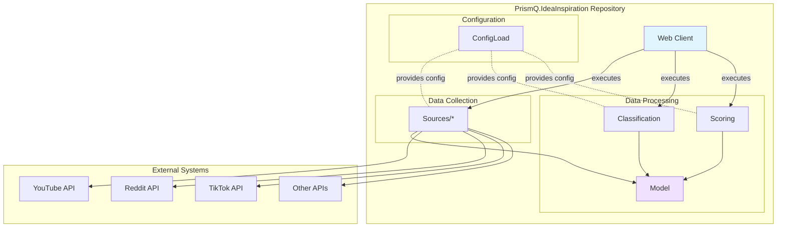

## Future Enhancements

### Planned Features
1. **Database Integration**: Replace JSON files with SQLite/PostgreSQL
2. **User Authentication**: Multi-user support with authentication
3. **Module Marketplace**: Discover and install new modules
4. **Scheduling**: Cron-like scheduled module execution
5. **Analytics Dashboard**: Visualize trends and statistics
6. **API Rate Limiting**: Protect against abuse
7. **WebSocket Support**: Bidirectional communication for advanced features
8. **Container Support**: Run modules in Docker containers
9. **Remote Execution**: Execute modules on remote workers
10. **Result Caching**: Cache module outputs for reuse

### Scalability Improvements
1. **Load Balancing**: Distribute runs across multiple workers
2. **Queue System**: Redis/RabbitMQ for job queuing
3. **Distributed Storage**: S3/MinIO for log storage
4. **Monitoring**: Prometheus/Grafana integration
5. **Tracing**: OpenTelemetry for distributed tracing

## Appendix

### Glossary

- **Module**: A PrismQ data collection or processing script
- **Run**: A single execution instance of a module
- **SSE**: Server-Sent Events, one-way real-time communication
- **ASGI**: Asynchronous Server Gateway Interface
- **SPA**: Single Page Application

### Related Documentation

- [Main README](../README.md) - Project overview
- [Backend Documentation](../_meta/docs/BACKEND.md) - Backend details
- [Frontend Documentation](../_meta/docs/FRONTEND.md) - Frontend details
- [API Reference](../Backend/API_REFERENCE.md) - REST API documentation
- [Testing Guide](../_meta/docs/TESTING.md) - Test coverage and commands

### Architecture Diagrams Legend

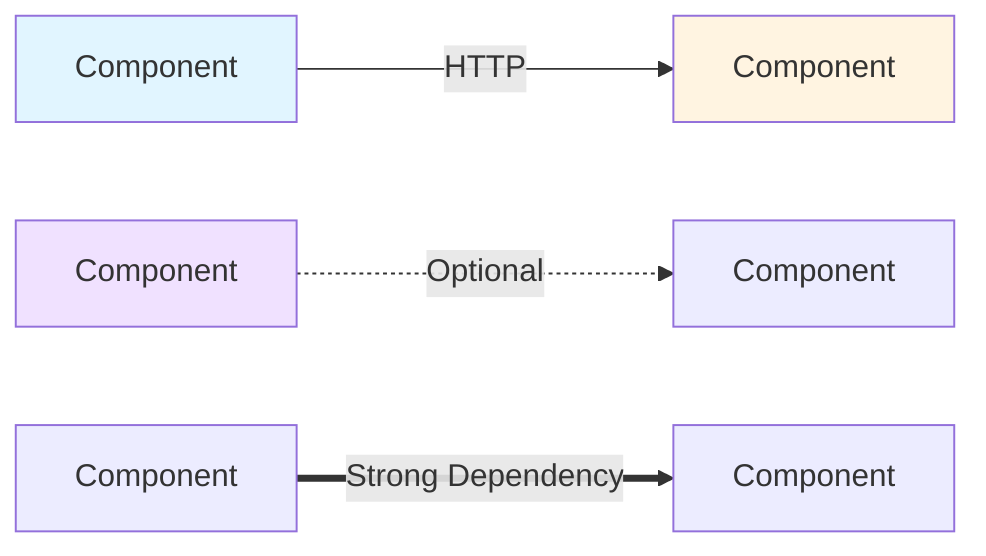

- **Solid Arrow**: Direct dependency or communication
- **Dotted Arrow**: Optional or conditional dependency
- **Double Arrow**: Strong/required dependency
- **Blue**: Frontend components
- **Yellow**: Backend components
- **Purple**: External modules

---

**Version**: 1.0.0  
**Last Updated**: 2025-10-31  
**Authors**: PrismQ Development Team
