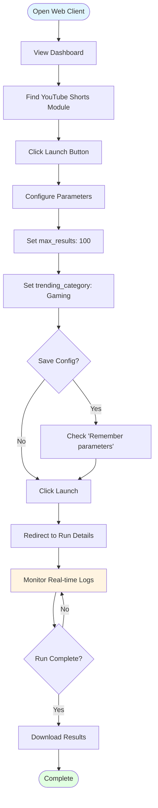
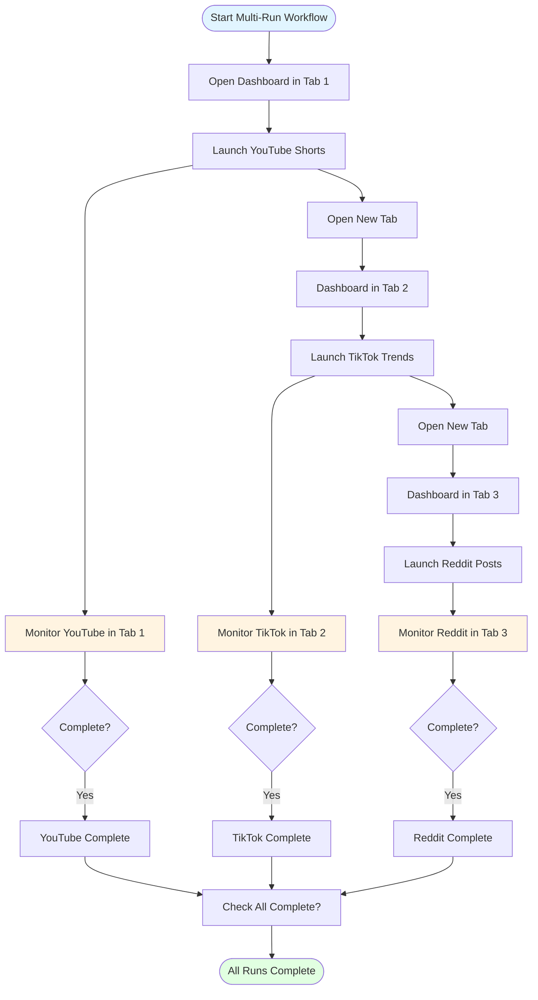
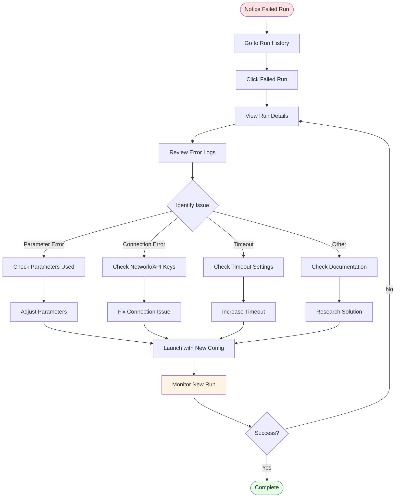

# PrismQ Web Client - User Guide

Complete guide for using the PrismQ Web Client to discover, configure, and run PrismQ modules.

## Table of Contents

- [Getting Started](#getting-started)
- [Dashboard Overview](#dashboard-overview)
- [Launching Modules](#launching-modules)
- [Monitoring Execution](#monitoring-execution)
- [Managing Runs](#managing-runs)
- [Configuration Management](#configuration-management)
- [Best Practices](#best-practices)

## Getting Started

### Prerequisites

Before using the Web Client, ensure:

1. Both backend and frontend servers are running
2. You can access http://localhost:5173
3. Modules are configured in `Backend/configs/modules.json`

See [SETUP.md](SETUP.md) if you haven't installed the application yet.

### First Launch

1. **Open the Web Client:**
   Navigate to http://localhost:5173 in your browser.

2. **View the Dashboard:**
   You'll see the module dashboard showing all available PrismQ modules.

3. **Browse Modules:**
   Scroll through the module cards to see what's available.

## Dashboard Overview

The dashboard is your main control center for managing PrismQ modules.

### Module Cards

Each module is displayed as a card showing:

- **Module Name**: Human-readable name
- **Description**: Brief description of what the module does
- **Category**: Module category (e.g., Sources/Content/Shorts)
- **Status**: Current execution status
- **Tags**: Quick identification tags
- **Launch Button**: Click to configure and run the module

### Search and Filter

**Search Modules:**
- Use the search box at the top to find modules by name or description
- Search is case-insensitive and searches across all module metadata

**Filter by Category:**
- Click on category badges to filter modules
- Multiple categories can be selected

**Filter by Status:**
- View all modules
- View only running modules
- View completed modules
- View failed modules

### Module Categories

Modules are organized into categories:

- **Sources**: Data collection modules
  - Content (YouTube, TikTok, Reddit, etc.)
  - Signals (Trends, hashtags, topics)
  - Commerce, Events, Community, Creative
- **Scoring**: Content evaluation and ranking
- **Classification**: Content categorization
- **Model**: Core data structures

## Launching Modules

### Basic Module Launch

1. **Select a Module:**
   Click the "Launch" button on any module card.

2. **Configure Parameters:**
   A modal dialog appears with configuration options:
   - **Required Parameters**: Must be filled in (marked with *)
   - **Optional Parameters**: Can be left at default values
   - **Parameter Types**:
     - Text fields for strings
     - Number inputs for integers/decimals
     - Dropdowns for select options
     - Checkboxes for boolean values
     - Password fields for sensitive data

3. **Review Configuration:**
   - Check that all required fields are filled
   - Verify parameter values are appropriate
   - Note any validation errors

4. **Save Configuration (Optional):**
   - Check "Remember these parameters" to save for future runs
   - Saved configurations are loaded automatically next time

5. **Launch:**
   Click "Launch" to start the module execution.

6. **Redirect to Run Details:**
   You'll be automatically redirected to the run details page.

### Parameter Types Guide

#### Text Parameters

Example: `search_query`, `output_file`

```
Input: "gaming tutorials"
```

- Enter any text value
- Check for length limits if specified

#### Number Parameters

Example: `max_results`, `timeout_seconds`

```
Input: 100
```

- Enter whole numbers or decimals as specified
- Respect min/max limits shown
- Use up/down arrows or type directly

#### Select Parameters

Example: `trending_category`, `sort_order`

```
Options: Gaming, Music, Sports, News
```

- Click dropdown to see all options
- Select one value from the list
- Cannot enter custom values

#### Checkbox Parameters

Example: `include_metadata`, `enable_verbose_logging`

```
☑ Enabled / ☐ Disabled
```

- Click to toggle on/off
- Checked = true, Unchecked = false

#### Password Parameters

Example: `api_key`, `api_secret`

```
Input: ••••••••••••
```

- Text is masked for security
- Not saved in configuration by default
- Re-enter for each run

### Advanced Launch Options

#### Using Saved Configurations

If you previously saved a configuration:

1. Click "Launch" on the module
2. Form is pre-filled with saved values
3. Modify any parameters as needed
4. Launch or update saved configuration

#### Clearing Saved Configurations

To reset to defaults:

1. Launch the module
2. Click "Clear Saved Configuration"
3. Form resets to default values
4. Can now save a new configuration

## Monitoring Execution

### Run Details Page

After launching a module, you're taken to the run details page showing:

#### Status Section

- **Run ID**: Unique identifier for this run
- **Module Name**: Which module is running
- **Status Badge**:
  - 🟡 Running - Module is executing
  - 🟢 Completed - Finished successfully
  - 🔴 Failed - Encountered an error
  - ⚫ Cancelled - Stopped by user

#### Progress Section

- **Start Time**: When the module started
- **Duration**: How long it's been running
- **Items Processed**: Count of items processed (if reported by module)
- **Progress Percentage**: Completion percentage (if available)

#### Parameters Section

Shows the parameters used for this run:
- Parameter names and values
- Helpful for troubleshooting or replicating runs

#### Logs Section

Real-time log viewer showing:
- **Live Streaming**: Logs appear as they're generated
- **Timestamps**: Each log line is timestamped
- **Auto-scroll**: Automatically scrolls to show latest logs
- **Search**: Find specific text in logs
- **Download**: Save logs to file for analysis

### Real-Time Log Streaming

Logs are streamed in real-time using Server-Sent Events (SSE):

- **Immediate**: Logs appear within seconds
- **Continuous**: Connection stays open during execution
- **Reliable**: Automatically reconnects if connection drops

**Log Controls:**
- **Auto-scroll**: Toggle to stop automatic scrolling
- **Clear**: Clear the log view (doesn't affect saved logs)
- **Download**: Download current logs as a text file
- **Search**: Find specific text in logs

### Understanding Log Messages

Modules typically output:

```
[2025-10-31 10:30:15] INFO: Starting YouTube Shorts collection...
[2025-10-31 10:30:16] INFO: Connecting to YouTube API...
[2025-10-31 10:30:17] INFO: Fetching trending videos...
[2025-10-31 10:30:18] INFO: Processing video 1/50: "Gaming Tutorial"
[2025-10-31 10:30:19] INFO: Processing video 2/50: "Music Video"
...
[2025-10-31 10:32:45] INFO: Collection complete. Processed 50 videos.
```

**Log Levels:**
- `INFO`: General information
- `DEBUG`: Detailed debugging information
- `WARNING`: Something unexpected but not critical
- `ERROR`: An error occurred

## Managing Runs

### Viewing Active Runs

From the dashboard:

1. **Active Runs Section**: Shows currently running modules
2. **Click on a Run**: View details and logs
3. **Monitor Progress**: See real-time status updates

### Viewing Run History

**All Runs:**
- Dashboard shows recent runs
- Click "View All Runs" for complete history

**Run Details:**
- Click any run to see details
- View parameters used
- Download logs
- See final status and duration

### Cancelling Runs

To stop a running module:

1. Go to the run details page
2. Click "Cancel Run"
3. Confirm cancellation
4. Module process is terminated
5. Status updates to "Cancelled"

**Note**: Cancellation is immediate but module cleanup may take a few seconds.

### Downloading Logs

To save logs for analysis:

1. Open run details page
2. Click "Download Logs"
3. Logs are saved as `run-{run_id}-{timestamp}.txt`
4. Contains all output from the module

## Configuration Management

### Saving Module Configurations

When launching a module:

1. Check "Remember these parameters"
2. Configuration is saved automatically
3. Next launch pre-fills with saved values

**What's Saved:**
- All parameter values
- Parameter names and types
- Timestamp of last save

**What's NOT Saved:**
- Password/secret fields
- Run history
- Execution results

### Loading Configurations

Saved configurations load automatically:

1. Click "Launch" on a module
2. If configuration exists, form is pre-filled
3. Modify as needed
4. Launch or save new configuration

### Updating Configurations

To change saved configuration:

1. Launch module (loads saved config)
2. Modify parameters
3. Check "Remember these parameters"
4. Click "Launch" or "Save"

### Deleting Configurations

To remove a saved configuration:

1. Launch module
2. Click "Clear Saved Configuration"
3. Configuration is deleted
4. Form resets to defaults

## Best Practices

### Module Selection

- **Read Descriptions**: Understand what each module does
- **Check Requirements**: Some modules need API keys or credentials
- **Review Parameters**: Know what parameters do before launching
- **Start Small**: Use lower max_results for testing

### Configuration

- **Save Common Configs**: Save frequently used configurations
- **Use Descriptive Values**: Makes logs easier to understand
- **Test First**: Try with small datasets before large runs
- **Document Custom Configs**: Note why you chose specific values

### Monitoring

- **Watch Initial Output**: First few log lines show if module started correctly
- **Check for Errors**: Look for ERROR or WARNING messages
- **Monitor Resource Usage**: Large runs may impact system performance
- **Use Multiple Tabs**: Open multiple runs in separate browser tabs

### Performance

- **Concurrent Runs**: You can run multiple modules simultaneously
- **System Resources**: Monitor CPU/RAM usage
- **Network**: Some modules are network-intensive
- **Disk Space**: Logs and data consume disk space

### Troubleshooting

- **Check Logs First**: Most issues are explained in logs
- **Verify Connectivity**: Ensure backend is running
- **Review Parameters**: Double-check parameter values
- **Test Individually**: If multiple modules fail, test one at a time
- **Consult Documentation**: See [TROUBLESHOOTING.md](TROUBLESHOOTING.md)

### Security

- **Localhost Only**: Web client is designed for localhost access
- **Sensitive Data**: Be careful with API keys and passwords
- **Log Contents**: Logs may contain sensitive information
- **Access Control**: Anyone with localhost access can use the client

## Common Workflows

### Workflow 1: Collecting YouTube Shorts



**Steps**:

1. Open dashboard
2. Find "YouTube Shorts Source" module
3. Click "Launch"
4. Configure:
   - `max_results`: 100
   - `trending_category`: "Gaming"
5. Check "Remember these parameters"
6. Click "Launch"
7. Monitor logs for progress
8. Download results when complete

### Workflow 2: Running Multiple Collectors



**Steps**:

1. Launch YouTube Shorts collector
2. Return to dashboard (new tab or browser back)
3. Launch TikTok collector
4. Launch Reddit collector
5. Use browser tabs to monitor each
6. All run concurrently

### Workflow 3: Scheduled Collection

The web client doesn't have built-in scheduling, but you can:

1. Save configuration for module
2. Document the configuration
3. Run manually at desired intervals
4. Or use external scheduler (cron, Task Scheduler) with CLI

### Workflow 4: Troubleshooting Failed Runs



**Steps**:

1. Find failed run in history
2. Click to view details
3. Review error messages in logs
4. Check parameters used
5. Adjust parameters
6. Retry with new configuration

## Keyboard Shortcuts

- **Ctrl/Cmd + K**: Focus search box
- **Esc**: Close modal dialogs
- **Ctrl/Cmd + R**: Refresh page

## Tips and Tricks

### Quick Launch

For modules you run frequently:
1. Save configuration once
2. Future launches are just: Click → Launch

### Monitoring Multiple Runs

Open each run in a separate browser tab:
1. Right-click module → "Open link in new tab"
2. Or middle-click the module card

### Finding Logs

All logs are saved in `Backend/logs/runs/`:
```
Backend/logs/runs/
├── run-abc123-2025-10-31-103015.log
├── run-def456-2025-10-31-103120.log
└── ...
```

### Performance Optimization

For faster module execution:
- Close unused browser tabs
- Reduce `max_results` for testing
- Run resource-intensive modules one at a time
- Check system resource usage

## Getting Help

### Documentation

- **Setup Issues**: [SETUP.md](SETUP.md)
- **Configuration**: [CONFIGURATION.md](CONFIGURATION.md)
- **API Reference**: [API.md](API.md)
- **Troubleshooting**: [TROUBLESHOOTING.md](TROUBLESHOOTING.md)
- **Development**: [DEVELOPMENT.md](DEVELOPMENT.md)

### Support Channels

1. **Check Documentation**: Most questions are answered here
2. **Review Logs**: Errors are usually explained in logs
3. **GitHub Issues**: https://github.com/Nomoos/PrismQ.IdeaInspiration/issues
4. **API Docs**: http://localhost:8000/docs (when running)

## Next Steps

- **Explore Modules**: Try different PrismQ modules
- **Learn the API**: Check out [API.md](API.md)
- **Contribute**: See [DEVELOPMENT.md](DEVELOPMENT.md)
- **Add Modules**: Learn to add modules in [MODULES.md](MODULES.md)

---

**Version**: 1.0.0  
**Last Updated**: 2025-10-31  
**Maintained by**: PrismQ Development Team
